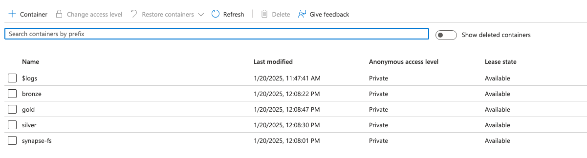

# Azure Project : Trevor England

### About the Project:  
I got this inspiration from curiously watching an Azure Data Engineering tutorial. While I was watching the tutorial, I took notes on what the guy did and decided to give my own project a try while referring to my notes. This project aims to migrate data from an on premise SQL Server into Azure Data Factory to be stored in a data lake. From there, the data will undergo transformations (Bronze, Silver, Gold), and ultimately be displayed in a dashboard at the end of the project. The tutorial I watched, the guy was using a Windows Machine so he used SSMS to interact with the on premise SQL Server. I am running on a Mac, so I have a few additional steps to make this work.  


---  

## Table of Contents  

- [Set Up (MAC)](#Setup)  
- [Data Extraction](#dataingestion)  
- [Data Transformation](#datatransformation)  
- [Data Loading](#loaddata)  
- [Dashboard (Tableau)](#tableau)  

---


## Setup  

Install SQL Server and SSMS. If you're on a MAC like me, you'll need to install Docker Desktop for MacOS. Once you've installed this, you need to pull a SQL Server image to docker. 

1. Ensure you have docker installed.  
```bash  
docker --version  
```  

2. Pull the SQL Server image for Docker. (You can use another image if you'd like)  
```bash  
docker pull mcr.microsoft.com/mssql/server:2022-latest  
```  

3. Run SQL Server in a Docker container  
```bash  
docker run -e "ACCEPT_EULA=Y" -e "<USERNAME>_PASSWWORD=<PASSWORD>" -p 1433:1433 --name sqlserver -d mcr.microsoft.com/mssql/server:2022-latest 
```   

4. Verify the container is running.  
```bash  
docker ps  
```  

Download [Azure Data Studio](https://learn.microsoft.com/en-us/azure-data-studio/download-azure-data-studio?tabs=win-install%2Cwin-user-install%2Credhat-install%2Cwindows-uninstall%2Credhat-uninstall)  

Once this is downloaded, you'll want to add a connection to a server, and give the required details for connection. (server name, username, password. Use SQL Authentication).  

Once you've logged in, you'll next want to find a sample database to load in. I used [this](https://learn.microsoft.com/en-us/sql/samples/adventureworks-install-configure?view=sql-server-ver16&tabs=ssms) one.  

This will download a .bak file to downloads. Move the file somewhere accessible so you can restore the database by doing the following:  

1. Copy the file to the container.  
```bash  
docker cp /path/to/your/file.bak <servername>:/var/opt/mssql/data/  
```  

You can verify in the container logs that the .bak file was copied, then head to Azure Data Studio and click on "query" to run the following query.

```sql  
RESTORE DATABASE <DATABASENAME>  
FROM DISK = '/var/opt/mssql/data/file.bak'
WITH MOVE '<DATABASENAME>_Data' TO '/var/opt/mssql/data/<DATABASENAME>.mdf',  
MOVE '<DATABASENAME>_Log' TO '/var/opt/mssql/data/<DATABASENAME>_log.ldf'; 
```   


You should now be able to click on "Databases" and see your database populated. Your data is now on premise.  

Next, you'll need to create a few Azure Resources to include an Azure Data Factory, a data lake (storage account), Databricks workspace, Azure Synapse Analytics workspace, and a keyvault.  You'll want to create these resources within the same resource group.  

Things to note: 
    - For the storage account, you should enable "heiarchial structure". This essentially turns your storage account into a data lake.  
    - You might have to give yourself the proper permissions to create containers in your storage account.  
    - Mostly everything i've left at the defaults. Do you research on pricing, and please please please set a budget on your resource group to alert you if your resources somehow end up costing more money than you're willing to spend.  

In the end, you should have something similar to this structure:  
  
  

Finally, you'll want to install either PowerBI or Tableau. Since PowerBI requires Windows, I opted for Tableau. You can download Tableau for free [here](https://www.tableau.com/products/public/download?_gl=1*1qdgnz9*_ga*NTczODY5MTU2LjE3Mzc0MDM5MDI.*_ga_8YLN0SNXVS*MTczNzQwMzkwMC4xLjEuMTczNzQwMzk2NS4wLjAuMA..&_ga=2.233025950.1411837766.1737403902-573869156.1737403902)  

This should be the entire set up for the rest of the project. In this phase, we've pulled an image to run SQL Server in a Docker container, connected Azure Data Studio to our SQL Server, restored a sample database, and provisioned all the resources within the Azure Portal that we will use for the rest of the project.  

---  

## Data Extraction  


