# Azure Project : Trevor England

### About the Project:  
I got this inspiration from curiously watching an Azure Data Engineering tutorial. While I was watching the tutorial, I took notes on what the guy did and decided to give my own project a try while referring to my notes. This project aims to migrate data from an on premise SQL Server into Azure Data Factory to be stored in a data lake. From there, the data will undergo transformations (Bronze, Silver, Gold), and ultimately be displayed in a dashboard at the end of the project. The tutorial I watched, the guy was using a Windows Machine so he used SSMS to interact with the on premise SQL Server. I am running on a Mac, so I have a few additional steps to make this work.  


---  

## Table of Contents  

- [Set Up (MAC)](#Setup)  
- [Data Extraction](#Extraction)  
- [Data Transformation](#Transformation)  
   &nbsp;&nbsp;&nbsp;&nbsp; [Bronze](#Bronze)
   &nbsp;&nbsp;|&nbsp;&nbsp; [Silver](#Silver)
- [Data Loading](#Load)  
- [Dashboard (Tableau)](#Dashboard)  

---


## Setup  

Install SQL Server and SSMS. If you're on a MAC like me, you'll need to install Docker Desktop for MacOS. Once you've installed this, you need to pull a SQL Server image to docker. 

1. Ensure you have docker installed.  
```bash  
docker --version  
```  

2. Pull the SQL Server image for Docker. (You can use another image if you'd like)  
```bash  
docker pull mcr.microsoft.com/mssql/server:2022-latest  
```  

3. Run SQL Server in a Docker container  
```bash  
docker run -e "ACCEPT_EULA=Y" -e "<USERNAME>_PASSWWORD=<PASSWORD>" -p 1433:1433 --name sqlserver -d mcr.microsoft.com/mssql/server:2022-latest 
```   

4. Verify the container is running.  
```bash  
docker ps  
```  

Download [Azure Data Studio](https://learn.microsoft.com/en-us/azure-data-studio/download-azure-data-studio?tabs=win-install%2Cwin-user-install%2Credhat-install%2Cwindows-uninstall%2Credhat-uninstall)  

Once this is downloaded, you'll want to add a connection to a server, and give the required details for connection. (server name, username, password. Use SQL Authentication).  

Once you've logged in, you'll next want to find a sample database to load in. I used [this](https://learn.microsoft.com/en-us/sql/samples/adventureworks-install-configure?view=sql-server-ver16&tabs=ssms) one.  

This will download a .bak file to downloads. Move the file somewhere accessible so you can restore the database by doing the following:  

1. Copy the file to the container.  
```bash  
docker cp /path/to/your/file.bak <servername>:/var/opt/mssql/data/  
```  

You can verify in the container logs that the .bak file was copied, then head to Azure Data Studio and click on "query" to run the following query.

```sql  
RESTORE DATABASE <DATABASENAME>  
FROM DISK = '/var/opt/mssql/data/file.bak'
WITH MOVE '<DATABASENAME>_Data' TO '/var/opt/mssql/data/<DATABASENAME>.mdf',  
MOVE '<DATABASENAME>_Log' TO '/var/opt/mssql/data/<DATABASENAME>_log.ldf'; 
```   


You should now be able to click on "Databases" and see your database populated. Your data is now on premise.  

Next, you'll need to create a few Azure Resources to include an Azure Data Factory, a data lake (storage account), Databricks workspace, Azure Synapse Analytics workspace, and a keyvault.  You'll want to create these resources within the same resource group.  

Things to note: 
    - For the storage account, you should enable "heiarchial structure". This essentially turns your storage account into a data lake.  
    - You might have to give yourself the proper permissions to create containers in your storage account.  
    - Mostly everything i've left at the defaults. Do you research on pricing, and please please please set a budget on your resource group to alert you if your resources somehow end up costing more money than you're willing to spend.  

In the end, you should have something similar to this structure:  
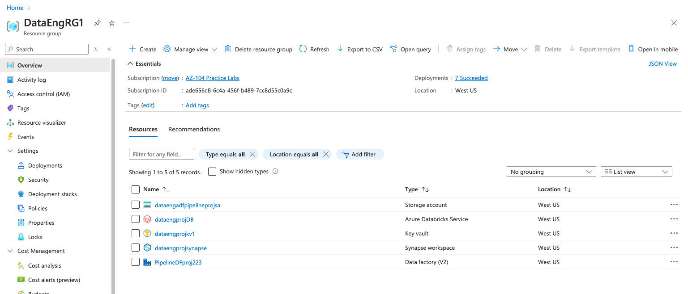  
  

Finally, you'll want to install either PowerBI or Tableau. Since PowerBI requires Windows, I opted for Tableau. You can download Tableau for free [here](https://www.tableau.com/products/public/download?_gl=1*1qdgnz9*_ga*NTczODY5MTU2LjE3Mzc0MDM5MDI.*_ga_8YLN0SNXVS*MTczNzQwMzkwMC4xLjEuMTczNzQwMzk2NS4wLjAuMA..&_ga=2.233025950.1411837766.1737403902-573869156.1737403902)  

This should be the entire set up for the rest of the project. In this phase, we've pulled an image to run SQL Server in a Docker container, connected Azure Data Studio to our SQL Server, restored a sample database, and provisioned all the resources within the Azure Portal that we will use for the rest of the project.  

---  

## Extraction  

In this stage, we will be getting the data from on premise into the cloud. Start by:  

1. In Azure Data Studio (or SSMS depending on what you're using), create a new query that creates a username and password for a user to the database.  

```sql  
CREATE LOGIN <username> WITH PASSWORD = '<password>'  
CREATE USER <username> FOR LOGIN <user>;  
```  

2. Head to Azure Keyvault. Click on Role Based Access Control, Or "Access Policies" depending on how you configured your keyvault. You will know if you try to click on Access Policies and it says something like "This Keyvault is configured for RBAC". If you're using RBAC, select "Create a Role Assignment", search for "Key Vault Administrator" and assign the permissions to yourself. (Assuming you have owner access over your subscription, or you're a global admin). If you're using Access Policies, create a new access policy and assign yourself the permissions under the "Secrets" portion for Get, List, Read, Create, Update, Delete. Search for your alias, review and create. From here, you'll click on "Secrets" tab, and create a new secret. Name the secret something meaningful, like "sqlserverpassword" and copy/paste your password from the sql query into the value section. Create the secret.  
   
3. Navigate to Azure Data Factory, go into the workspace. Click on new pipeline and name the pipeline. Under "Activities", search for "Copy Data". Drag and drop the copy data activity into the window pane on the right.  
   
4. Take a look around at the settings. Configure it how you wish, but make sure to click on "new source dataset". From here, search "sql" and select SQL Server. From here you'll need to follow fill out required fields. Create new linked service and name it. Under Integration Runtimes, select "new integration runtime", then select Self Hosted Integration Runtime. You want to select this option because you're moving data from on premise to Azure. If you were moving data within azure, you could keep the runtime as AutoResolve.  

5. There will be a link that you need to download for Express and 2 authentication keys that appear. This is where if you're following along with my steps on a MacBook, things are about to get a bit weird. When you try to download the express link, your MacBook will say that the application cannot be opened. This is because only Windows will support this. So what to do? You could use a different tool altogether to get your data into Azure, one that supports Linux and Windows. Or, you can create a Windows Virtual Machine, install the express application there, have the integrated runtime on your Windows VM to copy the data over. Although maybe not the most efficient way to solve the problem, it is good practice for creating resources and making configuration changes to connect components. So here's what I had to do, which may differ from what you need to do.
   
   #todo : create point to site vpn instead of opening the port in the router.
    A. Create a Windows VM. this can be done directly on your macbook with something like parallels, or you can use Azure.  
    B. Modify your NSG rules to allow RDP connection inbound, and https outbound, and port 1433 outbound for the Docker container.  **NOTE**: This is not the most secure method. At the end of the project, I might create a P2S VPN Gateway to demonstrate how that looks, but keep in mind if you follow that route you will be paying for the VPN and it's associated public IP's that it requires.    
    C. Head back to ADF, click the express link and follow the installation guide.  
    D. In my case, I had to login to my home internet router and create a port forwarding rule to map to my MacBooks private IP address over port 1433.  
    E. You'll also need to install a Java Runtime Engine on your Windows VM for parsing the parqet files in a later step. DROP LINK This is what I used. Once you install this, you'll need to go into your Windows VM settings and create an environment variable called           "JAVA_HOME" and paste the full path to where the JRE was installed. Then, under that you'll need to create a new Path for the JRE. Again, after this, create a new path that references the BIN folder of the JRE.  

   NOTE: If you choose this method, the Windows Machine must be running when you try to copy the data since this basically allows the pipeline to be connected to the Docker contianer. If your VM is not running, you won't be able to connect. With this, to save costs while you're not working on the project, be sure to stop the VM and delete your public IP address so you're not paying for it. To stop and deallocate a VM, Open CloudShell in the Azure portal. then run the following:  

```bash  
RG=<RESOURCEGROUP>  
NAME=<WINDOWSVMNAME>  
az account set --subscription <SUBSCRIPTIONID>  
az vm deallocate --resource-group $RG --name $NAME  
```  

Then, whenever you come back to work on the project, search for "public ip" and create a new public ip. assign it to your Windows VM. Then run the above commands, except the last line should be:  
```bash  
az vm start --resource-group $RG --name $NAME  
```  

7. Once you've done the above, change the "Mandatory" field for encryption to "optional". This is to allow the traffic past any firewalls. In authentication, type in your username then select "Azure KeyVault". You'll create a new linked service.  At some point in this, there will be an option to assign a managed identity access to the keyvault. You'll want to assign the Data Factory Managed Identity the role of "Secrets Reader", or if access policy for "get" secret. Once you're done, select the subscription the keyvault is in, select the keyvault, then select the secret name that contains your users password. In the end your Role Assignments should look something similar to this:  

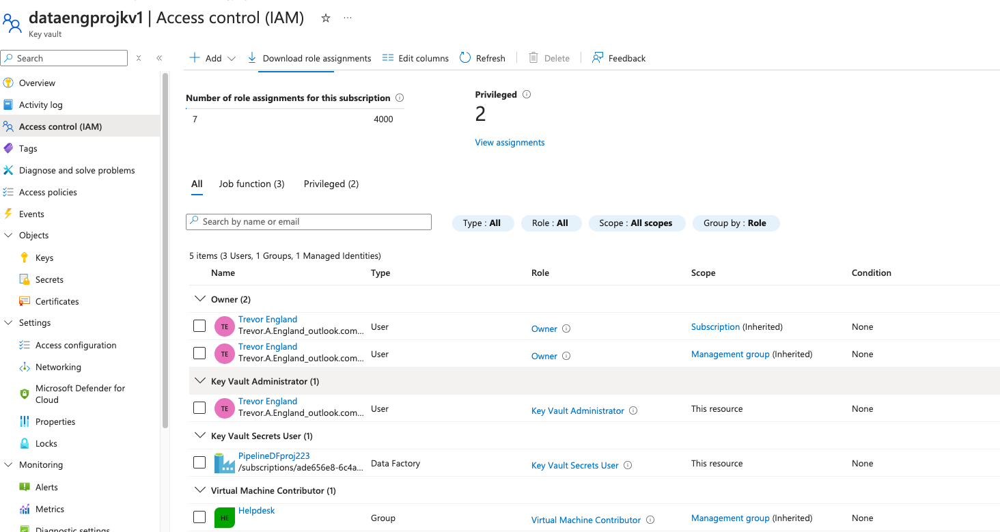    

8. Click on "Sink" and specify the file path for where the data should go. In our case, click the blue link, and select "bronze" from the dropdown.  

9. Now, go back to Azure Data Studio and run the query:  
   ```sql  
   USE <databasename>  
   GRANT SELECT ON <tablename> TO <username>;  
   ```  
10. Back in Azure Data Factory, Select "Test Connection". If your connection is validated with no errors, click on the icon in the window pane of "Copy Data" then click "Debug at the top"  
11. You'll see a pipeline appear. If this succeeds, you will have successfully copied over the tablename that you specified in the query. In my example, I used "AdventureWorksLT2022.Address".  

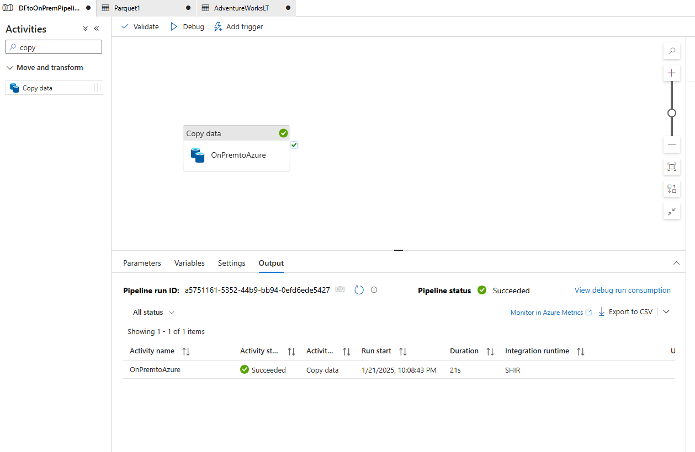  

12. To verify this, head to your storage account and click into the bronze container. you should see a parquet file in there with the title of your table name.  Now that we know this works, you can delete that file because instead of only getting 1 table, we want all the tables in the database to be copied over. So we will head back to Azure Data Factory for this.  

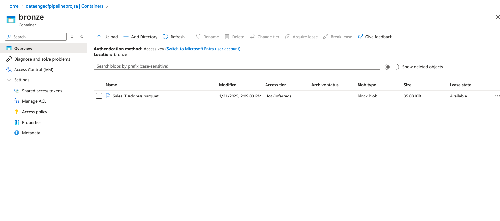  

### Data Ingestion Pt. 2  

1. Navigate to Azure Data Factory. If you haven't already, select "publish all", then you can either delete or edit your current pipeline to copy data from ALL tables. In my case, I deleted the pipeline since making a new one was good practice, plus all the linked services were still created so it was only a matter of re-selecting them + adding the dynamic content in.  

2. I deleted my pipeline, then clicked "new pipeline", renamed it as "copy_all_tables_from_onprem". From here, I searched "lookup" in the activities box, drag and drop into the window pane. Click settings, and edit the source dataset to be the SQL database.  Click "open" option, de-select the table (since we want multiple tables).  

3. Go back a level, unselect the "first row only" option, and select query. In the query box, put the following query in:  
```sql
SELECT s.name AS SchemaName, t.name AS TableName
FROM sys.tables t
INNER JOIN sys.schemas s
ON t_schema_id = s_schema_id
WHERE s.name = 'SalesLT';
```
This is basically creating a view of the database for us to query instead of querying the actual database itslef later on.  

4. Go back to Azure Data Studio, and run the following query:  
```sql
USE <DATBASENAME>;
GRANT SELECT ON SCHEMA::SalesLT TO <USER>
```

This grants the user logged in access to all the tables in the database. Go back to Azure Data Factory and click debug. Make sure this succeeds and check the output. You should see all the tables populate to the left as well.  

5. Search for the "ForEach" activity. drag and drop to the right of the Lookup activity. From here, select the "success" button on the Lookup activity and draw a line from Lookup to the ForEach box. This just indicates what the structure of the pipeline. If the LookUp is successful, then it should go to this step. Within the ForEach activity, you'll see a + sign, or you may even see the Copy Data activity directly. Make sure the Copy Data activity is put within the ForEach activity.

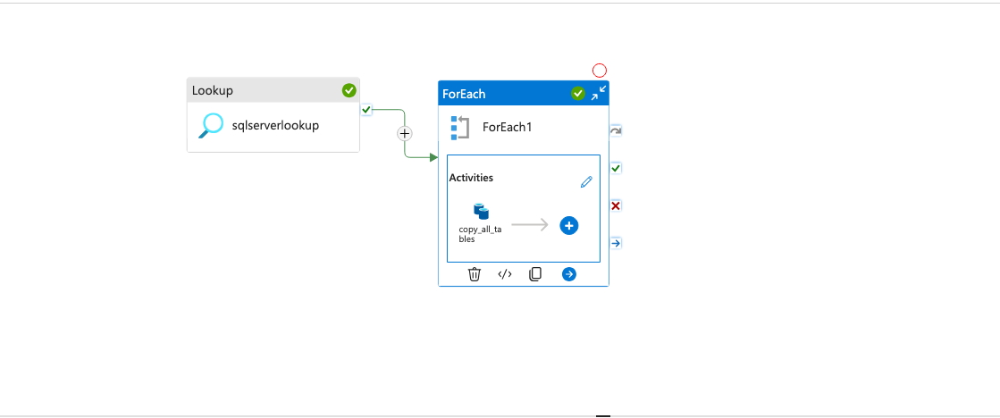  

7. Select the dataset. Then select "query" again. Here, you'll want to select "add dynamic content" link. These queries are basically as if you're querying the database in Azure Data Studio, but you're doing it from Azure Data Factory and it will be ran upon running the pipeline. So here, you'll want to input the following:  

```sql
@{concat('SELECT * FROM ', item().SchemaName,'.',item().TableName)}
```

This allows us to dynamically get all of the tables in the database. Notice that earlier we set s.name as SchemaName and t.name as TableName, and here we reference those aliases.  

7. Select "sink" then select the Parquet option that should still be there. Select open. Select Parameters. put in two parameters here: schemaname, tablename  

8. Go back to sink. You should see the two parameters you just made. For the value of each, select "add dyamic content" and put the following for their respective values:  
```sql
@item().schemaname
@item().tablename
```

10. Go back to sink and select open next to the parquet option. You'll see the file path. Select directory, add dynamic content:  
```sql
@{concat(dataset().schemaname, '/', dataset().tablename)}
```

12. Select OK, then for the File section select add dynamic content:  
```sql
@{concat(dataset().tablename,'.parquet')}
```  

14. This should be the set up, from here you can publish all changes and trigger the pipeline. You can head watch the pipeline from the output tab, or you can go to monitor and select pipelines.

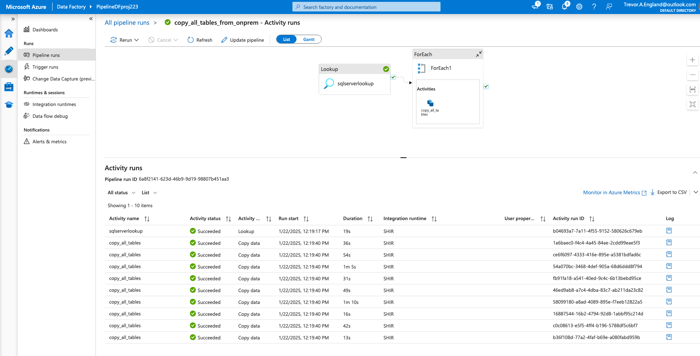  

16. After all are successful, verify the data and it's structure within the bronze container in the storage account.  

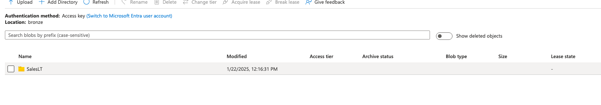  
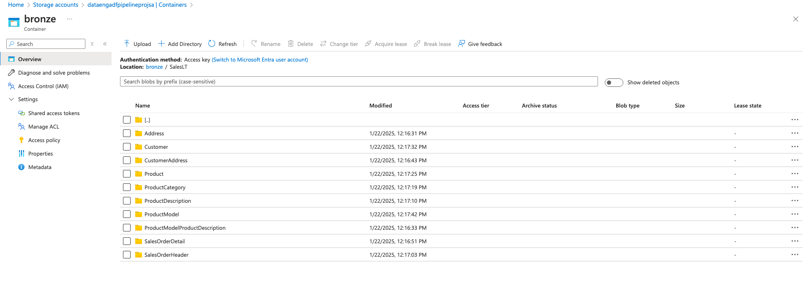  
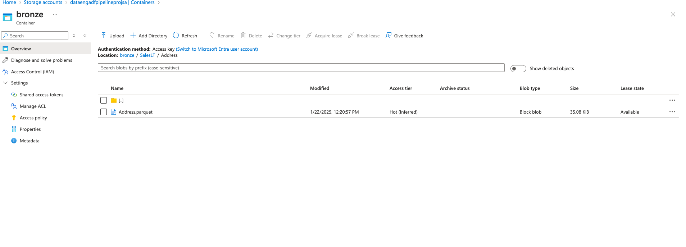  

# Transformation  

1. In Azure Portal, go to your databricks resource. You'll want to upgrade to premium to use a feature for later, then click launch workspace.  

2. Once you're here click on "Compute" to create a cluster. Go for a standard general purpose cluster. I picked the DSV_2. Click advanced settings, and click "Enable credential passthrough".  

3. While your cluster is creating, click New -> Notebook.  

4. From here, we need to create a mount point to the data lake in the storage account. **NOTE**: The code from this comes from Luke J Byrne's youtube channel. You can also find the code [here](https://learn.microsoft.com/en-us/azure/databricks/archive/credential-passthrough/adls-passthrough)    
```python
configs = {
    "fs.azure.account.auth.type": "CustomAccessToken",
    "fs.azure.account.custom.token.provider.class": spark.conf.get("spark.databricks.passthrough.adls.gen2.tokenProviderClassName")
}

dbutils.fs.mount(
    source = "abfss://bronze@<yourstorageaccountname>.dfs.core.windows.net/",
    mount_point = "/mnt/bronze",
    extra_configs = configs
)
```  

Likewise, you'll want to create mount points for the silver and gold containers in that storage account as well.  
```python
dbutils.fs.mount(
source = "abfss://silver@<yourstorageaccountname>.dfs.core.windows.net/",
mount_point = "mnt/silver",
extra_configs = configs
)

dbutils.fs.mount(
    source = "abfss://gold@<yourstorageaccountname>.dfs.core.windows.net/",
    mount_point = "/mnt/gold",
    extra_configs = configs
)
```  

You should have something like this once you're complete with the above steps  

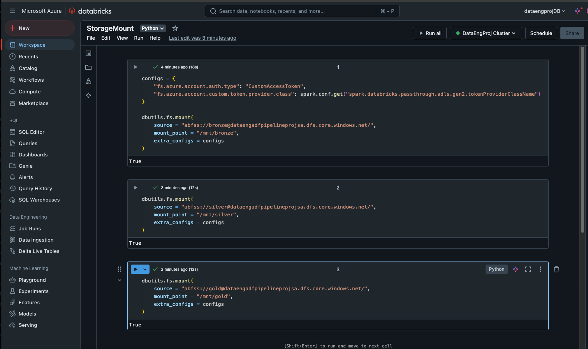  

5. Next, you'll want to create another notebook just as you did for the storage mount notebook. We now need to code the transformation from bronze to silver. 

### <ins>Bronze</ins>  

**PART A** - Lists all the files in the bronze/SalesLT/ path in your storage account. Then, you'll do the same for silver, which should return an empty array. There shouldn't be anything in your silver container at this point. After this, you'll load in the Address.parquet file into a data frame so that you can see the table when you call the data frame. None of these step are vital for success in this project, but it does help you see exactly what is going on.  

```python
dbutils.fs.ls('mnt/bronze/SalesLT/')
```  

```python
dbutils.fs.ls('mnt/silver/')
```  

```python
df = spark.read.format('parquet').load('/mnt/bronze/SalesLT/Address/Address.parquet')
```  

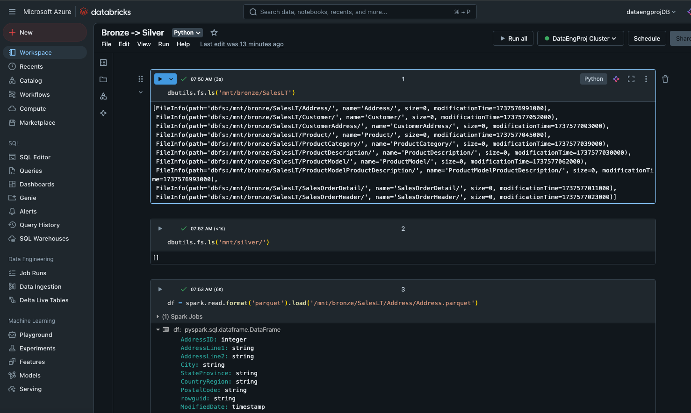  

**PART B** - Here, all you're doing is displaying the data frame you specified above, which is the contents of the address.parquet file.  

```python
display(df)
```  

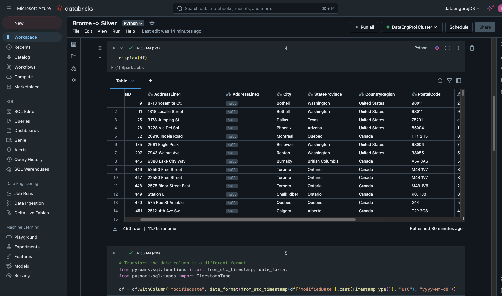  

**Note:** the date format before the transformation  

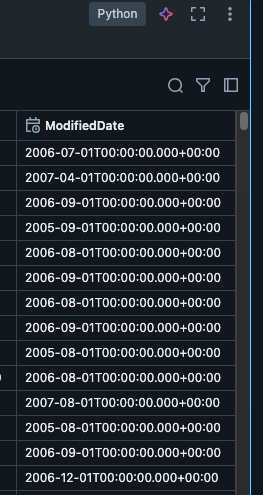  

**PART C** - Here is the bread and butter of "bronze" objective. The main transformation in this stage revolves around changing the date format to be more human readable, and easier to interact with when querying against this dataset. Then, you'll display the data frame and verify that the *ModifiedDate* column has indeed changed formats.  

```python
from pyspark.sql.functions import from_utc_timestamp, date_format
from pyspark.sql.types import TimestampType

df = df.withColumn("ModifiedDate", date_format(from_utc_timestamp(df['ModifiedDate'].cast(TimestampType()), "UTC"), "yyyy-MM-dd"))
```  

```python
display(df)
```

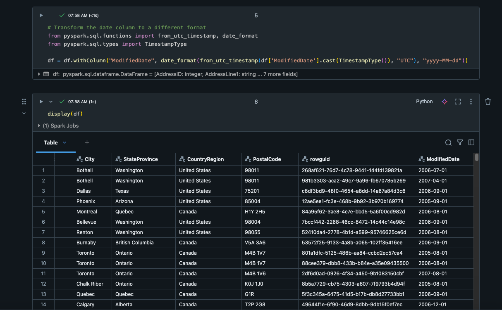  

**PART D** - So now that we've successfully changed the date format for the Address table, we now want to do it for all tables. Technically, you could (and probably would) omit the above steps, but for learning purposes and practice I included them. So first you'll create an empty list for the table names. Loop through all the tables within the bronze/SalesLT directory, and append them to the list. Now that you have your list of table names, you'll write a nested for loop. The outer loop will iterate through every table, dynamically changing the path for each iteration, loading that parquet file into the dataframe, and then grabbing all the columns within that data frame. The inner for loop will iterate through all the columns in the data frame, searching for the word "Date" or "date" (Since we know only one column includes this word, this approach is fine), then once you have that column, you apply the same logic as in Part C to transform the date format. From here our transformation is complete, so we want to put this transformed data into the next level (silver container) which we already have mounted.  

```python
table_name = []

for i in dbutils.fs.ls('mnt/bronze/SalesLT/'):
    table_name.append(i.name.split('/'[0]))

table_name
```  

```python
from pyspark.sql.functions import from_utc_timestamp, date_format
from pyspark.sql.types import TimestampType

for i in table_name:
    path = '/mnt/bronze/SalesLT/' + i + '/' + '.parquet'
    df = spark.read.format('parquet').load(path)
    column = df.columns

    for col in column:
        if "Date" in col or "date" in col:
            df = df.withColumn(col, date_format(from_utc_timestamp(df[col].cast(TimestampType()), "UTC"), "yyyy-MM-dd"))

    output_path = '/mnt/silver/SalesLT/' + i + '/'
    df.write.format('delta').mode('overwrite').save(output_path)
```  

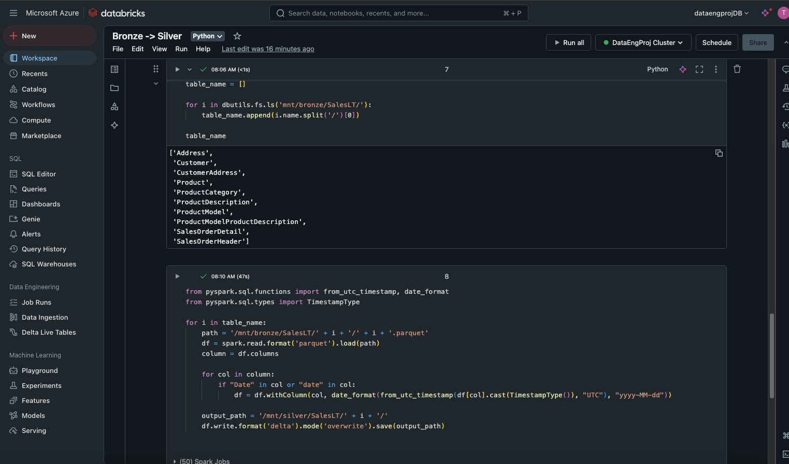  

### <ins>Silver</ins>  

Now that the data has gone through the transformation in the Bronze container and is pushed into the Silver container, we can do further transformations here. Create a new notepad, just as you did for the Bronze Container. I named mine Bronze -> Silver.  Again, I'll break this into parts with the code, screenshots, and explanation of what is happening. Additionally, I'll include my exported databricks notebook.  

**Part A** - Pretty much the same as before, start by listing out the files in the silver container under the directory *SalesLT*. Then, list out the files in the gold container (which there should not be any yet). After, we load data from the Address table in to the dataframe. We use 'delta' because that is how the data was stored coming from Bronze into Silver. Delta is built on top of parquet and has additional features. Parquet is typically used for raw data ingestion, whereas delta is used for semi-clean data that's traveling since it does have versioning capabilities and eases time traveling.   

```python  
dbutils.fs.ls('mnt/silver/SalesLT/')
```  

```python
dbutils.fs.ls('mnt/gold/')
```  

```python
df = spark.read.format('delta').load('/mnt/silver/SalesLT/Address/')
```  

```python
display(df)
```  

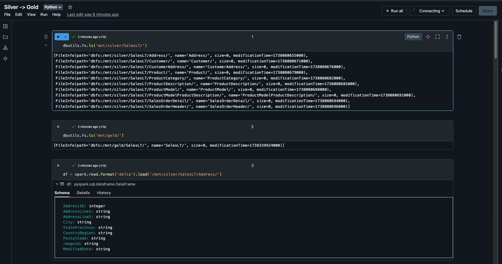  
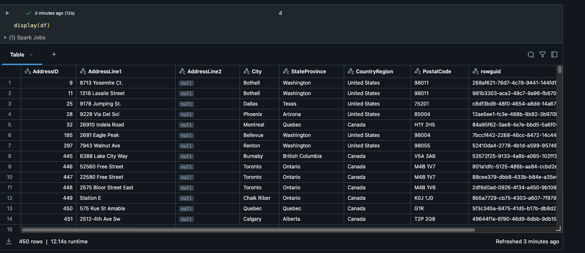  

**Part B** - Here, we are creating a function to minimize the re-use of code in later steps. In the Bronze section, we had repeateded code which is a bad practice.  

```python
from pyspark.sql.functions import col

def rename_columns_to_snake_case(df):

    # Get the list of column names
    column_names = df.columns

    # Dictionary to hold old and new mappings
    rename_map = {}

    for old_col_name in column_names:
        # Convert the column names to snake_case
        new_col_name = "".join([
            "_" + char.lower() if (
                # Check if the current character is uppercase
                char.isupper()
                # Make sure it's not the first character
                and idx > 0
                # Make sure the previous character is not uppercase
                and not old_col_name[idx - 1].isupper()
            # Convert character to lowercase
            ) else char.lower()
            # Remove any leading underscores
            for idx, char in enumerate(old_col_name)
        ]).lstrip("_")

        # Avoid renaming to an existing column name
        if new_col_name in rename_map.values():
            raise ValueError(f"Duplicate column name was found after renaming: '{new_col_name}'")
        
        # Map the old column name to the new column name
        rename_map[old_col_name] = new_col_name
    
    # Rename the columns using the mapping
    for old_col_name, new_col_name in rename_map.items():
        df = df.withColumnRenamed(old_col_name, new_col_name)

    return df
```  

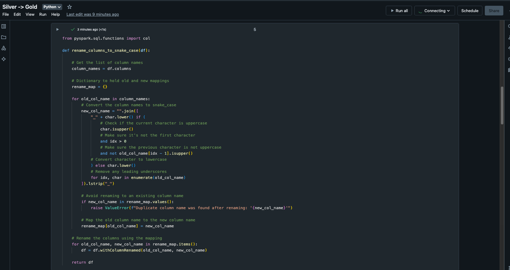  

**PART C** - Here, we are calling the function we created above, passing in the data frame we created in part A. Essentially, the function runs on that data frame, and then reassigns the variable "df" to the output of the function (which is the new and improved data frame).  

```python
df = rename_columns_to_snake_case(df)
```  

```python
display(df)
```  

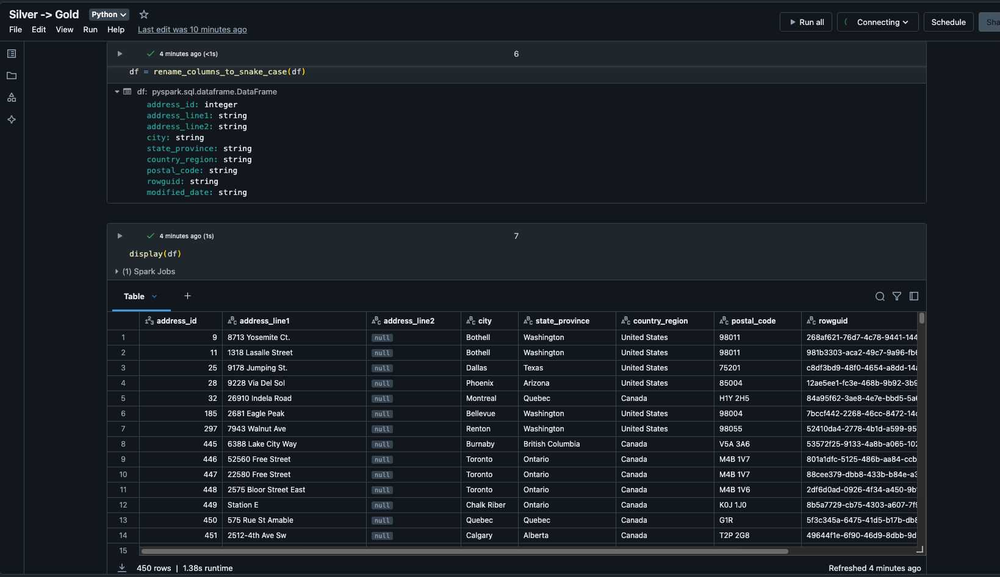  

**Part D** - Here, we create a temporary table name variable (temporary in the sense of we aren't actually using this variable beyond this point, but it still technically exists in memory). The purpose of this was to see the format of the files.  After we know the format, we can manipulate the name of the table in the manner we want, which is consistent with how we did it in Bronze -> Silver.  

```python
table_name_temp = []

for i in dbutils.fs.ls('mnt/silver/SalesLT'):
    table_name_temp.append(i)

table_name_temp
```  

```python
table_name = []

for i in dbutils.fs.ls('mnt/silver/SalesLT'):
    table_name.append(i.name.split('/')[0])

table_name
```  

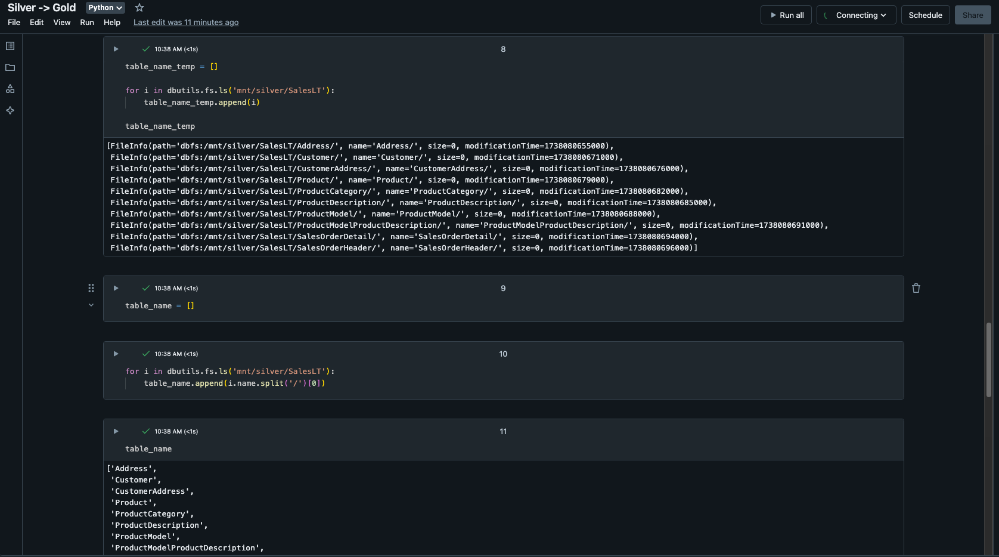  

**Part E** - Here, we iterate through the table name list we made above, so that the path in the gold container is consistent with the paths of other containers. We print out the path as well so we can make sure it looks good. We create a new data frame by passing in the paths above, which is iterating through the table names. So each table is being passed into the function, which is being assigned to the dataframe. Then we are specifying the output path to be the gold conatiner under the SalesLT directory, and writing each data frame (each transformed table), to the gold container under SalesLT.

```python
for name in table_name:
    path = '/mnt/silver/SalesLT/' + name
    print(path)
    df = spark.read.format('delta').load(path)

    df = rename_columns_to_snake_case(df)

    output_path = '/mnt/gold/SalesLT/' + name + '/'
    df.write.format('delta').mode('overwrite').save(output_path)
```  

```python
display(df)
```  

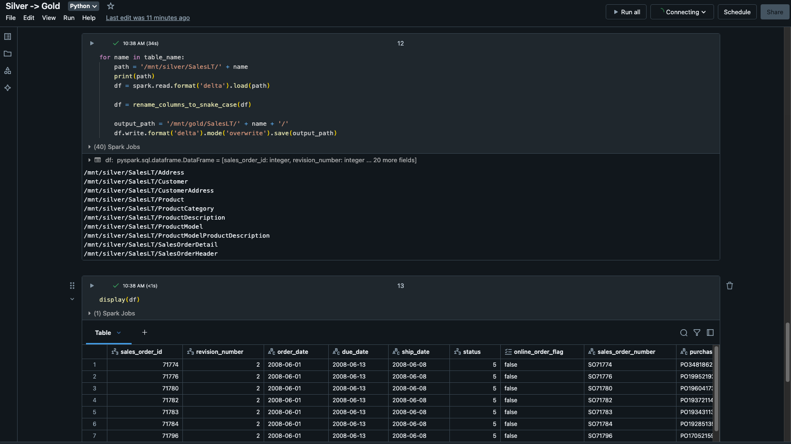  

### <ins>Add notebooks to Pipeline</ins>  

1. Keep Databricks open, but open a new tab and go to your Azure Data Factory workspace. Click on your pipeline, and search under "Activities" for "Notebook". Drag and drop the notebook icon to the right of the ForEach activity and connect a "on success" arrow to it.  

2. Rename the notebook activity then select "Azure Databricks" and create a new linked service. Select "AutoResolveIntegrationRuntime" since this data is already in Azure moving to another resource in Azure. Select your subscription, your Databricks workspace, choose "existing interactive cluster", and select "Access Token" for authentication.  

3. From here, go back to Databricks and select your profile at the top right corner. Select "Settings" then "Developer". Here you'll see an option for an access token; follow the steps and generate the token. 

4. Copy the access token and go to Azure Key Vault. Create a new secret with a meaningful name, and add your access token as the value. 

5. Go back to Azure Data Factory, select the key vault option under authentication, then select the secret you just created.  
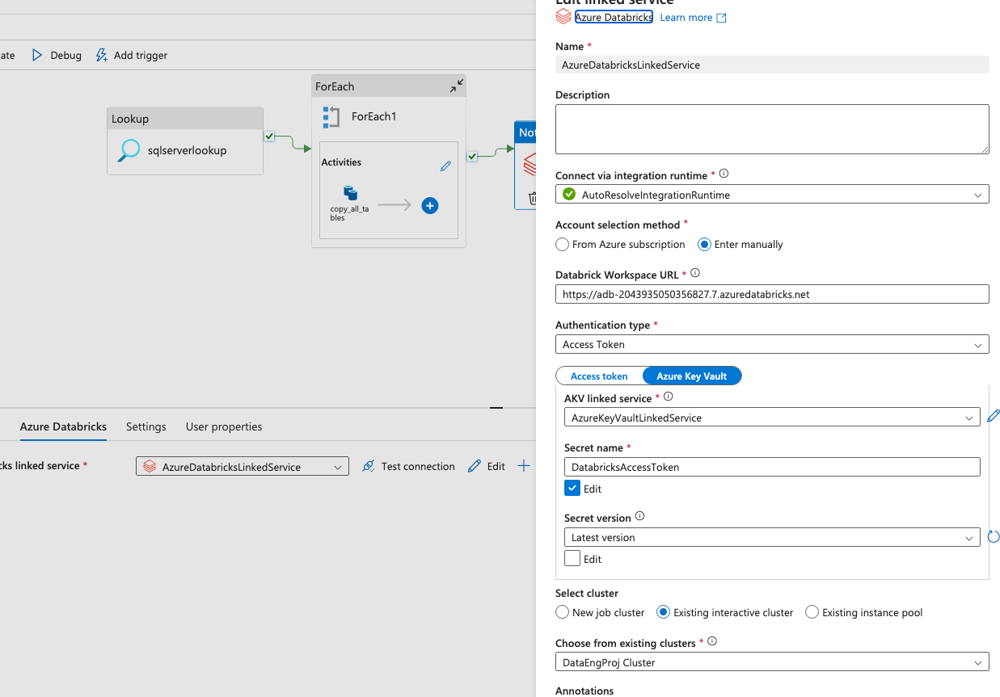  

6. Click the notebooks tab, and select browse. Find your notebook for "Bronze -> Silver". Mine was under users/<myusername>,Bronze -> Silver.  

7. Now, do this same process to add another notebook for "Silver -> Gold. In the end your diagram should look like this.  
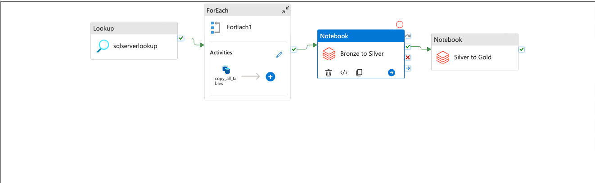  

8. Once you have the diagram like this, trigger your pipeline and watch it run under the "monitor" tab.  The result of a successful pipeline will look similar to this.  
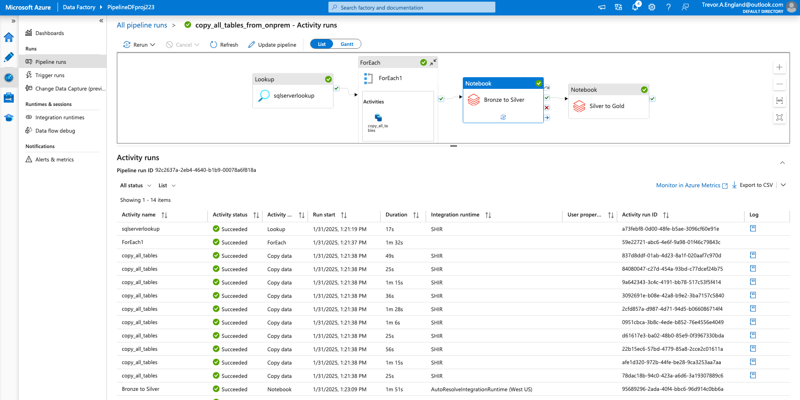  


