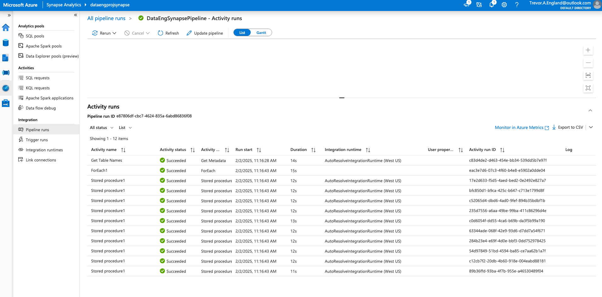

# Azure Project : Trevor England

### About the Project:  
I got this inspiration from curiously watching an Azure Data Engineering tutorial by Luke J Byrne on YouTube (He got this project from mr.ktalkstech). While I was watching the tutorial, I took notes on what Luke did and decided to give my own project a try while referring to my notes. This project aims to migrate data from an on premise SQL Server by using Azure Data Factory to store the data in a data lake (ADLS GEN2). From there, the data will undergo transformations (Bronze, Silver, Gold) via Databricks, and ultimately be loaded into an Azure SQL Database to run view queries on to eventually build dashboards with Tableau. The tutorial I watched, Luke was using a Windows machine so he used SSMS to interact with the on premise SQL Server. I am running on a Mac, so I have a few additional steps to make this work. I've also taken my own spin to to this project as I'll be using a Service Principal to the necessary resources and trigger pipelines in an automated fashion. I also create a VPN that connects my Macbook to my Azure virtual network where my Windows Virtual Machine is running (More on this later). This guide will help MAC USERS be able to complete this project. The goal of this project was to get my hands dirty in the world of building ETL/ELT pipelines, and to create something I can refer to for a project I want to build in the future (super excited about it).  


---  

## Table of Contents  

- [Set Up (MAC)](#Setup)  
- [Set Up (VPN)](#VPN)
- [Data Extraction](#Extraction)  
- [Data Transformation](#Transformation)  
   &nbsp;&nbsp;&nbsp;&nbsp; [Bronze](#Bronze)
   &nbsp;&nbsp;|&nbsp;&nbsp; [Silver](#Silver)
- [Data Loading](#Load)  
- [Helpful Resources](#Resources)
- [Dashboard (Tableau)](#Dashboard)  

---


## Setup  

Install SQL Server and SSMS. If you're on a MAC like me, you'll need to install Docker Desktop for MacOS. Once you've installed this, you need to pull a SQL Server image to docker. 

1. Ensure you have docker installed.  
```bash  
docker --version  
```  

2. Pull the SQL Server image for Docker. (You can use another image if you'd like)  
```bash  
docker pull mcr.microsoft.com/mssql/server:2022-latest  
```  

3. Run SQL Server in a Docker container  
```bash  
docker run -e "ACCEPT_EULA=Y" -e "<USERNAME>_PASSWWORD=<PASSWORD>" -p 1433:1433 --name sqlserver -d mcr.microsoft.com/mssql/server:2022-latest 
```   

4. Verify the container is running.  
```bash  
docker ps  
```  

Download [Azure Data Studio](https://learn.microsoft.com/en-us/azure-data-studio/download-azure-data-studio?tabs=win-install%2Cwin-user-install%2Credhat-install%2Cwindows-uninstall%2Credhat-uninstall)  

Once this is downloaded, you'll want to add a connection to a server, and give the required details for connection. (server name, username, password. Use SQL Authentication).  

Once you've logged in, you'll next want to find a sample database to load in. I used [this](https://learn.microsoft.com/en-us/sql/samples/adventureworks-install-configure?view=sql-server-ver16&tabs=ssms) one.  

This will download a .bak file to downloads. Move the file somewhere accessible so you can restore the database by doing the following:  

1. Copy the file to the container.  
```bash  
docker cp /path/to/your/file.bak <servername>:/var/opt/mssql/data/  
```  

You can verify in the container logs that the .bak file was copied, then head to Azure Data Studio and click on "query" to run the following query.

```sql  
RESTORE DATABASE <DATABASENAME>  
FROM DISK = '/var/opt/mssql/data/file.bak'
WITH MOVE '<DATABASENAME>_Data' TO '/var/opt/mssql/data/<DATABASENAME>.mdf',  
MOVE '<DATABASENAME>_Log' TO '/var/opt/mssql/data/<DATABASENAME>_log.ldf'; 
```   

You should now be able to click on "Databases" and see your database populated. Your data is now on premise.  

Next, you'll need to create a few Azure Resources to include an Azure Data Factory, a data lake (storage account), Databricks workspace, Azure Synapse Analytics workspace, and keyvault. Additionally, you'll need a Windows Virtual Machine and a Virtual Network Gateway if you're following my exact path. You'll want to create these resources within the same resource group.  

Things to note: 
    - For the storage account, you should enable "heiarchial structure". This essentially turns your storage account into a data lake.  
    - You wil need to give yourself the proper permissions to create containers and view blobs in your storage account.  
    - Mostly everything i've left at the defaults. Do your research on pricing, and please please please set a budget on your subscription to alert you if your resources somehow end up costing more money than you're willing to spend. 

In the end, you should have something similar to this structure:  
  
  

Finally, you'll want to install either PowerBI or Tableau. Since PowerBI requires Windows, I opted for Tableau. You can download Tableau for free [here](https://www.tableau.com/products/public/download?_gl=1*1qdgnz9*_ga*NTczODY5MTU2LjE3Mzc0MDM5MDI.*_ga_8YLN0SNXVS*MTczNzQwMzkwMC4xLjEuMTczNzQwMzk2NS4wLjAuMA..&_ga=2.233025950.1411837766.1737403902-573869156.1737403902)  

# VPN  

When I did this project, I actually got the pipeline working first without implementing the VPN by using a port forwarding rule on my internet router (unsecure, but free. If you do this, monitor your Docker logs to ensure no suspicious login activity is happening). For TSG purposes, I'll try to make this as fluid as possible.  

1. Create a Windows Virtual Machine.  

2. Modify the NSG rules:  
    **Inbound**: RDP, 1433 (Docker)  
    **Outbound**: HTTPS, 1433 (Docker)  

    You'll put a self hosted integration runtime on this Windows Machine. To install the SHIR, you'll need to RDP to the machine. Once you've done that, you can technically close the port for Inbound access. This machine will need 1433 access outbound to talk to your Docker container, and 443 access to communicate with ADF.  

3. Go to your Virtual Network associated with your Windows VM. Click "Subnets", and you should see a default subnet. You'll need to create a new subnet for your VNET gateway. This MUST be named "GatewaySubnet", and must be non-overlapping with your default subnet. EX. default is 10.0.0.0/24, you can create a GatewaySubnet at 10.0.1.0/27  

4. Once you've done this, create a Virtual Network Gateway. This must be in the same resource group and region as your virtual network. Additionally, pay attention to pricing here. VpnGW1 is around 130 USD a month in West US. You CAN deploy this programmatically at the Basic SKU level for much cheaper, but I don't believe it supports type IKEv2, which is needed if you're using the Mac OS native VPN client. If you're using a third party VPN like OpenVPN, I'm not sure if it would work. Here is a link to do some research. [P2S VPN](https://learn.microsoft.com/en-us/azure/vpn-gateway/point-to-site-vpn-client-cert-mac)  

5. This will take about 30 minutes to deploy. In the meantime, you can go ahead and set up your certificates. I used self-signed certificate authentication for this project. Here's how I did it.  

     *Setting up Self-Signed Certificates*  

   Keep in mind, this is pricey to keep running. Basic SKU is less than 30 dollars a month, but you'll need to create it via CLI and you're limited as to what tunnel types you can use. Since I used my Mac Native VPN client, I needed IKEv2.  This took me a couple of days to get working and figure it all out, so hopefully I'm not explaining this clear as mud.  

   1. Head to your Keychain in Mac. At the top, click "keychain access -> certificate assistant -> create a new certificate authority". You'll want this to be type VPN Server, give it a meaningful name, and it's a self signed root certificate. Create this certificate. It should appear in your keychain. To the left, click the arrow and underneath it should have an associated private key. Right click this key and select "Create a certificate with CA name". Select, this and name this something meaningful, selecting VPN Client as the type since this is going to be what makes the client certificate.  

   2. Right click on your root certificate, and select "get info". There will be a "trust" section, and select "always trust". Highlight the key underneath the root certificate, and export it as a .p12,  assigning an export password to it that you'll remember. I recommend making a directory for this as well named "certificates" and saving the file to this directory.  

   3. Before you proceed, you'll want to clone this github repository as it'll come in handy.  

   ```bash
   git clone https://github.com/chrisvugrinec/azure-vpn-point2site
   ```  

    He basically made scripts that walk you through the steps of how this should work. The problem I ran into is that I'm using openssl version 3.4, and some of the encryption methods needed by keychain are no longer supported by openssl. To get around this, I installed openssl version 1.1.  

    ```bash
    brew install openssl@1.1
    ```  

    I didn't export this into my path, but I was able to find where it resides in my filesystem and use it by directly accessing it. For me the path was /opt/homebrew/opt/openssl@1.1/bin/openssl  

   4. You can start with the second step as we already exported the private key from keychain.  Step 2 is 
   ```bash
   /opt/homebrew/opt/openssl@1.1/bin/openssl pkcs12 -in <rootca>.p12 -nocerts -out <rootca>.key
   ```  

   step 3  

   ```bash
   openssl req -new -key <rootca>.key -out <rootca>.csr
   ```  

   step 4  

   ```bash
   openssl x509 -req -days 3650 -in <rootca>.csr -signkey <rootca>.key -out <rootca>.crt
   ```
   From here, you'll want to put this rootca.crt file in the same directory as the "mac" directory in the github repository from earlier. Run the ./5_removeSpaces.sh script and give the name of your rootca.crt file. This removes the spaces from your public key inside, so that when you upload this to Azure portal there are no extra spaces, otherwise it won't work. (trust me, I spent way too long scratching my head here).  This will give you a new file with a naming convention like rootca.crt-nospaces.crt. This is the file you'll want to open later. For now, we continue though.  

   5. Open the rootca.crt file 
   ```bash 
   open <rootca>.crt 
   ```

   This will import the file into keychain, signed by the private key of your root certificate.  

     

   6. Now, open the nospaces file and copy the content up until the = sign. (INCLUSIVE)   
```bash
cat <rootca>.crt-nospaces.crt
```  

6. Ensure you have every character, no more no less, and head back to Azure portal. Now that your VPN Gateway has been deployed,select "Point-to-site configuration". Specify an address pool (private IP space that doesn't overlap with your gateway subnet). Select IKEv2 if you're using Mac native VPN client, or if you have a third-party VPN client use whatever tunnel type it supports.  Use Azure certificate for authentication. Paste this in the "Public certificate data" section, then assign a name to the certificate.  Click "Save" at the top and wait for the changes to reflect.  

7. Download the VPN Client. unzip the folder and you're mainly intereseted in the "Generic" folder if you're using IKEv2 with MAC native vpn client. You'll want to use cat to open the VpnSettings.xml file.  Then, open "System Preferences" and search for VPN. Near the bottom you'll see a button to click and then click "Add VPN Configuration", and select IKEv2.  Here, you'll name your connection, then for Server Address and Remote ID, you'll grab that from the xml file. There should be a tag for Server that starts with "azuregateway". Copy that address and paste into both sections. Your Local ID is going to be whatever you named your client certificate in Keychain. Select certificate for authentication, and browse for your client certificate (Probably only your Root and client will show).  From here, select create and try to connect. This should prompt you for a password, and select "Always allow" as we will automate this later.  I'll link a good youtube video that helped me out with creating this.  [Link](https://www.youtube.com/watch?v=cEbIvDrWnno)  

  

Once you've done this, go to your Windows Machine in Azure portal and downlaod the RDP file. Connect via RDP, and verify that you are able to ping your Macbook and SQL Server in the Docker container. To find your Macbook's private IP address while connected to the VPN...  

```bash
ifconfig
```

You're looking for ipsec0 interface and you should see an address assigned that falls within the address range you specified for your vpn.  Take that address, and from your Windows Machine, open powerhsell.  

  

  

This should be the entire set up for the rest of the project. In this phase, we've pulled an image to run SQL Server in a Docker container, connected Azure Data Studio to our SQL Server, restored a sample database, provisioned all the resources within the Azure Portal that we will use for the rest of the project, and set up a Point-To-Site VPN connection in Azure using Self-Signed certificate authentication.   

---  

## Extraction  

In this stage, we will be getting the data from on premise into the cloud. Start by:  

1. In Azure Data Studio (or SSMS depending on what you're using), create a new query that creates a username and password for a user to the database.  
```sql  
CREATE LOGIN <username> WITH PASSWORD = '<password>'  
CREATE USER <username> FOR LOGIN <user>;  
```  

2. Head to Azure Keyvault. Click on Role Based Access Control, Or "Access Policies" depending on how you configured your keyvault. You will know if you try to click on Access Policies and it says something like "This Keyvault is configured for RBAC". If you're using RBAC, select "Create a Role Assignment", search for "Key Vault Administrator" and assign the permissions to yourself. (Assuming you have owner access over your subscription, or you're a global admin). If you're using Access Policies, create a new access policy and assign yourself the permissions under the "Secrets" portion for Get, List, Read, Create, Update, Delete. Search for your alias, review and create. From here, you'll click on "Secrets" tab, and create a new secret. Name the secret something meaningful, like "sqlserverpassword" and copy/paste your password from the sql query into the value section. Create the secret.  
   
3. Navigate to Azure Data Factory, go into the workspace. Click on new pipeline and name the pipeline. Under "Activities", search for "Copy Data". Drag and drop the copy data activity into the window pane on the right.  
   
4. Take a look around at the settings. Configure it how you wish, but make sure to click on "new source dataset". From here, search "sql" and select SQL Server. From here you'll need to follow fill out required fields. Create new linked service and name it. Under Integration Runtimes, select "new integration runtime", then select Self Hosted Integration Runtime. You want to select this option because you're moving data from on premise to Azure. If you were moving data within azure, you could keep the runtime as AutoResolve.  

5. There will be a link that you need to download for Express and 2 authentication keys that appear. This is where if you're following along with my steps on a MacBook, things are about to get a bit weird. When you try to download the express link, your MacBook will say that the application cannot be opened. This is because only Windows will support this, which is why we created the Windows VM.  
      
    A. RDP to your Windows Machine and use the web browser to get to your ADF workspace.
    B. Click the express link and follow the installation guide.    
    C. You'll also need to install a Java Runtime Engine on your Windows VM for parsing the parqet files in a later step. Once you install this, you'll need to go into your Windows VM settings and create an environment variable called  "JAVA_HOME" and paste the full path to where the JRE was installed. Then, under that you'll need to create a new Path for the JRE. Again, after this, create a new path that references the BIN folder of the JRE.  

   NOTE: If you choose this method, the Windows Machine must be running when you try to copy the data since this basically allows the pipeline to be connected to the Docker contianer. If your VM is not running, you won't be able to connect. With this, to save costs while you're not working on the project, be sure to stop the VM and delete your public IP address so you're not paying for it. To stop and deallocate a VM, Open CloudShell in the Azure portal. then run the following:  

    ```bash  
    RG=<RESOURCEGROUP>  
    NAME=<WINDOWSVMNAME>  
    az account set --subscription <SUBSCRIPTIONID>  
    az vm deallocate --resource-group $RG --name $NAME  
    ```  

    Then, whenever you come back to work on the project, search for "public ip" and create a new public ip. assign it to your Windows VM. Then run the above commands, except the last line should be:  

    ```bash  
    az vm start --resource-group $RG --name $NAME  
    ```  

6. By now you should be seeing the linked service page. For server name, this should be your IP address when you're connected to the VPN (see above step for retrieving your IP from the VPN), so it should be in the format xxx.xxx.xxx.xxx,1433. Enter your database name, select SQL Authentication, type in the username you set on the datbase, select "Azure Key Vault" and create a linked service to your keyvault. You should have an option to assign a managed identity, do this and assign the managed identity the role of "Secrets User" so the MI can log in to your database from the pipeline using the secret you're setting here. For secret name, select the name of the secret which holds the password to your database for the user you're specifying. Change the encrypt option to "optional" to bypass any firewall authentication, and since we are using self-signed certificates, select "Trust Server Certificate".  **NOTE** You might have to upload your root certificate to the Docker container. To do this...  

```bash
docker cp <rootca>.crt <container_id>:/usr/local/share/ca-certificates/
docker exec -it --user root <container_id> bash
update-ca-certificates
exit
docker restart <container_id>
```  

    

8. Click on "Sink" and specify the file path for where the data should go. In our case, click the blue link, and select "bronze" from the dropdown.  

9. Now, go back to Azure Data Studio and run the query: 
   ```sql  
   USE <databasename>  
   GRANT SELECT ON <tablename> TO <username>;  
   ```  
10. Back in Azure Data Factory, Select "Test Connection". If your connection is validated with no errors, click on the icon in the window pane of "Copy Data" then click "Debug at the top"  

11. You'll see a pipeline appear. If this succeeds, you will have successfully copied over the tablename that you specified in the query. In my example, I used "AdventureWorksLT2022.Address".  

  

12. To verify this, head to your storage account and click into the bronze container. you should see a parquet file in there with the title of your table name.  Now that we know this works, you can delete that file because instead of only getting 1 table, we want all the tables in the database to be copied over. So we will head back to Azure Data Factory for this.  

  

### Data Ingestion Pt. 2  

1. Navigate to Azure Data Factory. If you haven't already, select "publish all", then you can either delete or edit your current pipeline to copy data from ALL tables. In my case, I deleted the pipeline since making a new one was good practice, plus all the linked services were still created so it was only a matter of re-selecting them + adding the dynamic content in.  

2. I deleted my pipeline, then clicked "new pipeline", renamed it as "copy_all_tables_from_onprem". From here, I searched "lookup" in the activities box, drag and drop into the window pane. Click settings, and edit the source dataset to be the SQL database.  Click "open" option, de-select the table (since we want multiple tables).  

3. Go back a level, unselect the "first row only" option, and select query. In the query box, put the following query in:  
```sql
SELECT s.name AS SchemaName, t.name AS TableName
FROM sys.tables t
INNER JOIN sys.schemas s
ON t_schema_id = s_schema_id
WHERE s.name = 'SalesLT';
```
This is basically creating a view of the database for us to query instead of querying the actual database itself later on.  

4. Go back to Azure Data Studio, and run the following query:  
```sql
USE <DATBASENAME>;
GRANT SELECT ON SCHEMA::SalesLT TO <USER>
```

This grants the user logged in access to all the tables in the database. Go back to Azure Data Factory and click debug. Make sure this succeeds and check the output. You should see all the tables populate to the left as well.  

5. Search for the "ForEach" activity. drag and drop to the right of the Lookup activity. From here, select the "success" button on the Lookup activity and draw a line from Lookup to the ForEach box. This just indicates what the structure of the pipeline. If the LookUp is successful, then it should go to this step. Within the ForEach activity, you'll see a + sign, or you may even see the Copy Data activity directly. Make sure the Copy Data activity is put within the ForEach activity.

  

6. Select the dataset. Then select "query" again. Here, you'll want to select "add dynamic content" link. These queries are basically as if you're querying the database in Azure Data Studio, but you're doing it from Azure Data Factory and it will be ran upon running the pipeline. So here, you'll want to input the following:  
```sql
@{concat('SELECT * FROM ', item().SchemaName,'.',item().TableName)}
```

This allows us to dynamically get all of the tables in the database. Notice that earlier we set s.name as SchemaName and t.name as TableName, and here we reference those aliases.  

7. Select "sink" then select the Parquet option that should still be there. Select open. Select Parameters. put in two parameters here: schemaname, tablename  

8. Go back to sink. You should see the two parameters you just made. For the value of each, select "add dyamic content" and put the following for their respective values:  
```sql
@item().schemaname
@item().tablename
```

10. Go back to sink and select open next to the parquet option. You'll see the file path. Select directory, add dynamic content:  
```sql
@{concat(dataset().schemaname, '/', dataset().tablename)}
```

12. Select OK, then for the File section select add dynamic content:  
```sql
@{concat(dataset().tablename,'.parquet')}
```  

14. This should be the set up, from here you can publish all changes and trigger the pipeline. You can watch the pipeline from the output tab, or you can go to monitor and select pipelines.

  

16. After all are successful, verify the data and it's structure within the bronze container in the storage account.  

  
  
  

# Transformation  

1. In Azure Portal, go to your databricks resource. You'll want to upgrade to premium to use a feature for later, then click launch workspace.  

2. Once you're here click on "Compute" to create a cluster. Go for a standard general purpose cluster. I picked the D3_V2. Click advanced settings, and click "Enable credential passthrough".  **NOTE** Credential passthrough only works for singe node/ single user types of compute. For now this is fine for development purposes, just keep in mind that later we will have to come back and change some of this.  

3. While your cluster is creating, click New -> Notebook.  Name this notebook StorageMount.  

4. From here, we need to create a mount point to the data lake in the storage account. **NOTE**: The code from this comes from Luke J Byrne's youtube channel. You can also find the code [here](https://learn.microsoft.com/en-us/azure/databricks/archive/credential-passthrough/adls-passthrough)    
```python
configs = {
    "fs.azure.account.auth.type": "CustomAccessToken",
    "fs.azure.account.custom.token.provider.class": spark.conf.get("spark.databricks.passthrough.adls.gen2.tokenProviderClassName")
}

dbutils.fs.mount(
    source = "abfss://bronze@<yourstorageaccountname>.dfs.core.windows.net/",
    mount_point = "/mnt/bronze",
    extra_configs = configs
)
```  

Likewise, you'll want to create mount points for the silver and gold containers in that storage account as well.  
```python
dbutils.fs.mount(
source = "abfss://silver@<yourstorageaccountname>.dfs.core.windows.net/",
mount_point = "mnt/silver",
extra_configs = configs
)

dbutils.fs.mount(
    source = "abfss://gold@<yourstorageaccountname>.dfs.core.windows.net/",
    mount_point = "/mnt/gold",
    extra_configs = configs
)
```  

You should have something like this once you're complete with the above steps  

  

5. Next, you'll want to create another notebook just as you did for the storage mount notebook. We now need to code the transformation from bronze to silver. 

### <ins>Bronze</ins>  

**PART A** - Lists all the files in the bronze/SalesLT/ path in your storage account. Then, you'll do the same for silver, which should return an empty array. There shouldn't be anything in your silver container at this point. After this, you'll load in the Address.parquet file into a data frame so that you can see the table when you call the data frame. None of these step are vital for success in this project, but it does help you see exactly what is going on.  

```python
dbutils.fs.ls('mnt/bronze/SalesLT/')
```  

```python
dbutils.fs.ls('mnt/silver/')
```  

```python
df = spark.read.format('parquet').load('/mnt/bronze/SalesLT/Address/Address.parquet')
```  

  

**PART B** - Here, all you're doing is displaying the data frame you specified above, which is the contents of the address.parquet file.  

```python
display(df)
```  

  

**Note:** the date format before the transformation  

  

**PART C** - Here is the bread and butter of "bronze" objective. The main transformation in this stage revolves around changing the date format to be more human readable, and easier to interact with when querying against this dataset. Then, you'll display the data frame and verify that the *ModifiedDate* column has indeed changed formats.  

```python
from pyspark.sql.functions import from_utc_timestamp, date_format
from pyspark.sql.types import TimestampType

df = df.withColumn("ModifiedDate", date_format(from_utc_timestamp(df['ModifiedDate'].cast(TimestampType()), "UTC"), "yyyy-MM-dd"))
```  

```python
display(df)
```

  

**PART D** - So now that we've successfully changed the date format for the Address table, we now want to do it for all tables. Technically, you could (and probably would) omit the above steps, but for learning purposes and practice I included them. So first you'll create an empty list for the table names. Loop through all the tables within the bronze/SalesLT directory, and append them to the list. Now that you have your list of table names, you'll write a nested for loop. The outer loop will iterate through every table, dynamically changing the path for each iteration, loading that parquet file into the dataframe, and then grabbing all the columns within that data frame. The inner for loop will iterate through all the columns in the data frame, searching for the word "Date" or "date" (Since we know only one column includes this word, this approach is fine), then once you have that column, you apply the same logic as in Part C to transform the date format. From here our transformation is complete, so we want to put this transformed data into the next level (silver container) which we already have mounted.  

```python
table_name = []

for i in dbutils.fs.ls('mnt/bronze/SalesLT/'):
    table_name.append(i.name.split('/'[0]))

table_name
```  

```python
from pyspark.sql.functions import from_utc_timestamp, date_format
from pyspark.sql.types import TimestampType

for i in table_name:
    path = '/mnt/bronze/SalesLT/' + i + '/' + '.parquet'
    df = spark.read.format('parquet').load(path)
    column = df.columns

    for col in column:
        if "Date" in col or "date" in col:
            df = df.withColumn(col, date_format(from_utc_timestamp(df[col].cast(TimestampType()), "UTC"), "yyyy-MM-dd"))

    output_path = '/mnt/silver/SalesLT/' + i + '/'
    df.write.format('delta').mode('overwrite').save(output_path)
```  

  

### <ins>Silver</ins>  

Now that the data has gone through the transformation in the Bronze container and is pushed into the Silver container, we can do further transformations here. Create a new notepad, just as you did for the Bronze Container. I named mine Bronze -> Silver.  Again, I'll break this into parts with the code, screenshots, and explanation of what is happening. Additionally, I'll include my exported databricks notebook.  

**Part A** - Pretty much the same as before, start by listing out the files in the silver container under the directory *SalesLT*. Then, list out the files in the gold container (which there should not be any yet). After, we load data from the Address table in to the dataframe. We use 'delta' because that is how the data was stored coming from Bronze into Silver. Delta is built on top of parquet and has additional features. Parquet is typically used for raw data ingestion, whereas delta is used for semi-clean data that's traveling since it does have versioning capabilities and eases time traveling.   

```python  
dbutils.fs.ls('mnt/silver/SalesLT/')
```  

```python
dbutils.fs.ls('mnt/gold/')
```  

```python
df = spark.read.format('delta').load('/mnt/silver/SalesLT/Address/')
```  

```python
display(df)
```  

  
  

**Part B** - Here, we are creating a function to minimize the re-use of code in later steps. In the Bronze section, we had repeateded code which is a bad practice.  

```python
from pyspark.sql.functions import col

def rename_columns_to_snake_case(df):

    # Get the list of column names
    column_names = df.columns

    # Dictionary to hold old and new mappings
    rename_map = {}

    for old_col_name in column_names:
        # Convert the column names to snake_case
        new_col_name = "".join([
            "_" + char.lower() if (
                # Check if the current character is uppercase
                char.isupper()
                # Make sure it's not the first character
                and idx > 0
                # Make sure the previous character is not uppercase
                and not old_col_name[idx - 1].isupper()
            # Convert character to lowercase
            ) else char.lower()
            # Remove any leading underscores
            for idx, char in enumerate(old_col_name)
        ]).lstrip("_")

        # Avoid renaming to an existing column name
        if new_col_name in rename_map.values():
            raise ValueError(f"Duplicate column name was found after renaming: '{new_col_name}'")
        
        # Map the old column name to the new column name
        rename_map[old_col_name] = new_col_name
    
    # Rename the columns using the mapping
    for old_col_name, new_col_name in rename_map.items():
        df = df.withColumnRenamed(old_col_name, new_col_name)

    return df
```  

  

**PART C** - Here, we are calling the function we created above, passing in the data frame we created in part A. Essentially, the function runs on that data frame, and then reassigns the variable "df" to the output of the function (which is the new and improved data frame).  

```python
df = rename_columns_to_snake_case(df)
```  

```python
display(df)
```  

  

**Part D** - Here, we create a temporary table name variable (temporary in the sense of we aren't actually using this variable beyond this point, but it still technically exists in memory). The purpose of this was to see the format of the files.  After we know the format, we can manipulate the name of the table in the manner we want, which is consistent with how we did it in Bronze -> Silver.  

```python
table_name_temp = []

for i in dbutils.fs.ls('mnt/silver/SalesLT'):
    table_name_temp.append(i)

table_name_temp
```  

```python
table_name = []

for i in dbutils.fs.ls('mnt/silver/SalesLT'):
    table_name.append(i.name.split('/')[0])

table_name
```  

  

**Part E** - Here, we iterate through the table name list we made above, so that the path in the gold container is consistent with the paths of other containers. We print out the path as well so we can make sure it looks good. We create a new data frame by passing in the paths above, which is iterating through the table names. So each table is being passed into the function, which is being assigned to the dataframe. Then we are specifying the output path to be the gold conatiner under the SalesLT directory, and writing each data frame (each transformed table), to the gold container under SalesLT.

```python
for name in table_name:
    path = '/mnt/silver/SalesLT/' + name
    print(path)
    df = spark.read.format('delta').load(path)

    df = rename_columns_to_snake_case(df)

    output_path = '/mnt/gold/SalesLT/' + name + '/'
    df.write.format('delta').mode('overwrite').save(output_path)
```  

```python
display(df)
```  

  

### <ins>Add notebooks to Pipeline</ins>  

1. Keep Databricks open, but open a new tab and go to your Azure Data Factory workspace. Click on your pipeline, and search under "Activities" for "Notebook". Drag and drop the notebook icon to the right of the ForEach activity and connect a "on success" arrow to it.  

2. Rename the notebook activity then select "Azure Databricks" and create a new linked service. Select "AutoResolveIntegrationRuntime" since this data is already in Azure moving to another resource in Azure. Select your subscription, your Databricks workspace, choose "existing interactive cluster", and select "Access Token" for authentication.  

3. From here, go back to Databricks and select your profile at the top right corner. Select "Settings" then "Developer". Here you'll see an option for an access token; follow the steps and generate the token. 

4. Copy the access token and go to Azure Key Vault. Create a new secret with a meaningful name, and add your access token as the value. 

5. Go back to Azure Data Factory, select the key vault option under authentication, then select the secret you just created.  

  

6. Click the notebooks tab, and select browse. Find your notebook for "Bronze -> Silver". Mine was under users/myusername/Bronze -> Silver.  

7. Now, do this same process to add another notebook for "Silver -> Gold. In the end your diagram should look like this. 

  

8. Once you have the diagram like this, trigger your pipeline and watch it run under the "monitor" tab.  The result of a successful pipeline will look similar to this.  

  

### Switching from AD Credentials to Service Principal  

Up until this point, we've been using "Enable Credential Passthrough" on a single node. Since you'll be using a Service Principal in the automation of this pipeline, this is a good transition point to configure this. If I leave something out, Microsoft is very well documented with service principal information, but I'll do my best here to not leave anything out.  

To create the service principal and give it access at the resource group level...  
```bash
az login
az account set --subscription "<SUBSCRIPTION_ID>"
az ad sp create-for-rbac --name "<service-principal-name>" --role Contributor --scopes /subscriptions/<SUBSCRIPTION_ID>/resourceGroups/<RESOURCE_GROUP>
```  

This will return JSON. The important thing to grab here is the "password" field. You'll want to store this value into your key vault.  

Now that you've stored the client secret in the key vault, you'll need to create a role for the service principal to access secrets. Create a role for the service principal of either "Key Vault Secrets User" or "Key Vault Administrator". I personally assigned administrator access to my service principal since in my script I have my service principal acquiring a web token and storing it in key vault then pulling it from keyvault to use in API calls to Databricks so as not to expose any secrets.

The next thing you'll need to do is head to your storage account for the project. You'll need to assign this service principal permissions to the blobs. Create a role for "Storage Blob Data Contributor", and search for your Service Principals name, assign the role.  Likewise, you'll need to create another role for AzureDatabricks service principal with the same permissions.  

Now, in Azure Databricks head to your settings by clicking the top right icon for your profile. In "Identity and Access", click service principals. You'll want to add your service principal here, giving it cluster creation and workspace access. I also assigned it Service Principal Manager access. User access may be sufficient, but I had a hard time getting my service principal to have access to run the notebooks at first.  

Next, you'll need to create a secret scope for databricks. First though, you'll need to install the databricks cli.  Then, you'll need to create the secret scope which allows you to dynamically pass in the service principals password, so you're not exposing secrets.  

```bash
brew install databricks

# Ensure You Have Databricks CLI Installed
databricks -v

databricks secrets create-scope --scope <SCOPE_NAME> --scope-backend-type AZURE_KEYVAULT --resource-id /subscriptions/<SUBSCRIPTION_ID>/resourceGroups/<RESOURCE_GROUP>/providers/Microsoft.KeyVault/vaults/<KEYVAULT_NAME> --dns-name <KEYVAULT_URI>
```

Now, you should be able to use this scope as a way to store secrets in a redacted state.  Head to your notebooks and create a new notebook, then do the following...  

```python
service_credential = dbutils.secrets.get(scope="<SCOPE_NAME>",key="<SERVICE_PRINCIPAL_SECRET")

spark.conf.set("fs.azure.account.auth.type.<STORAGE_ACCOUNT_NAME>.dfs.core.windows.net", "OAuth")
spark.conf.set("fs.azure.account.oauth.provider.type.<STORAGE_ACCOUNT_NAME>.dfs.core.windows.net", "org.apache.hadoop.fs.azurebfs.oauth2.ClientCredsTokenProvider")
spark.conf.set("fs.azure.account.oauth2.client.id.<STORAGE_ACCOUNT_NAME>.dfs.core.windows.net", "<APPLICATION_ID>")
spark.conf.set("fs.azure.account.oauth2.client.secret.<STORAGE_ACCOUNT_NAME>.dfs.core.windows.net", service_credential)
spark.conf.set("fs.azure.account.oauth2.client.endpoint.<STORAGE_ACCOUNT_NAME>.core.windows.net", "https://login.microsoftonline.com/<TENANT_ID>/oauth2/token")
```  

To make sure the secret is stored in service_credential...  

```python
print(len(service_credential))
```  

Now that you've configured Spark to authenticate using your service principal, you'll need to unmount from your mountpoints and remount, using some additional configurations.  In my StorageMount notebook, I did the following...  

```python
dbutils.fs.unmount("/mnt/bronze")
```  

```python
configs = {
    "fs.azure.account.auth.type": "OAuth",
    "fs.azure.account.oauth.provider.type": "org.apache.hadoop.fs.azurebfs.oauth2.ClientCredsTokenProvider",
    "fs.azure.account.oauth2.client.id": "<APPLICATION_ID>",
    "fs.azure.account.oauth2.client.secret": dbutils.secrets.get(scope="<SCOPE_NAME>", key="<SERVICE_PRINCIPAL_SECRET>"),
    "fs.azure.account.oauth2.client.endpoint": "https://login.microsoftonline.com/<TENANT_ID>/oauth2/token"
}

dbutils.fs.mount(
    source = "abfss://bronze@<STORAGE_ACCOUNT_NAME>.dfs.core.windows.net/",
    mount_point = "/mnt/bronze",
    extra_configs = configs
)
```  

Do the same for silver and gold respectively. You don't need to include the configs definition again, just unmount silver, then use the dbutils.fs.mount() command, replacing "bronze" with "silver", then do the same thing for gold.  From here, your service principal should be authenticated to access these notebooks, as well as access your data lake storage. But wait, there's more...  

Head back to ADF. For the automation script, you'll need to add a parameter at the pipeline level, then pass that parameter into the notebook and ultimately to the Linked Service. 

  

Then click on the "Bronze to Silver" notebook. In the Databricks tab, you'll want to see under Linked Service Properties this  
  

Click edit next to the linked service, and scroll down to where "existing cluster" is check marked. Make sure your blade looks like this  
  

Make these same changes for your Silver to Gold Notebook activity as well.  

What this process is doing, is since I delete my cluster when I'm done running the notebook to save on costs, there is no existing cluster to choose from in ADF. So in my script when I create the cluster, I'm passing in the cluster ID as a parameter into the pipeline run. The pipeline is set to accept a parameter of "clusterId", so it takes my cluster ID and assigns it to this parameter. This propagates the cluster ID to my linked service, which needs an existing cluster ID. So it takes the cluster ID parameter from the pipeline and uses that as the existing cluster to run the notebooks in Databricks.

# Load

1. Go to Synapse Analytics workspace and open a workspace. Choose the database icon on the left, click + and add a SQL database, choose serverless and give it a name.  

2. On the left, click on Linked, then open your linked service shown. This should open up the data lake for you to browse. Choose the gold container, right click on the address table, sql script, select top 100 rows, and choose delta format.  

3. Here, if you run the auto-generated sql it will return the top 100 rows from that table. Modify this scrip so that it is...  

```sql
CREATE VIEW SalesLT_AddressView AS
Select TOP 100 *
FROM OPENROWSET(
    BULK 'https://<yourstorageaccountnname.dfs.core.windows.net/gold/SalesLT/Address/',
    FORMAT = 'DELTA'
) AS [result]
```  
and click run. This will not return anything, it just creates the view to be the output of this query. To verify if the view was created...  

```sql
SELECT * FROM SalesLT_AddressView
```  

4. We could just create whatever view we want for each table in our database, but if we had thousands of tables here that would be very inefficient. Instead, we want to create a pipeline that will create these views for us, which we can do from data factory, but we can also use synapse (synapse is built on top of data factory, but has additional features. Everything we've done in this project could probably have been done in Synapse, including the databricks notebooks section.)  

5. Click develop, +, new sql script. Paste the following:  

```sql 
USE Gold_DB
GO 
CREATE OR ALTER PROC CreateSQLServerlessView_gold @ViewName nvarchar(100)
AS
BEGIN
    DECLARE @statement VARCHAR(MAX)
    SET @statement = N'CREATE OR ALTER VIEW ' + @ViewName + ' AS
        SELECT *
        FROM OPENROWSET(
            BULK ''https://<yourstorageaccountname>.dfs.core.windows.net/gold/SalesLT/' + @ViewName + '/'',
            FORMAT = ''DELTA''
        ) AS [result]'

    EXEC (@statement)
END 
GO
```  

Once you've done, publish your changes and run this.  

6. We now want to create the pipeline. To do this we need to create a linked service to connect the serverless database.  

7. Click on the Manage icon on the left -> linked services -> create. Give it a name, AutoResolveIntegrationRuntime. For the connection/auth part, I had problems with selecting the subscription, my synapse analytics, and finding my Gold_DB. only the master DB was showing up, so instead I clicked on enter manually and found my serverless endpoint from Azure portal (Go to Synapse, and on the left look for "Properties". You'll find the Serverless endpoint there), then for db name I manually typed in "Gold_DB" or whatever you named the database. I selected system-assigned managed identity, and then tested my connection and it worked. Once your validation passes, publish your changes.  

8. Now we can use this linked service to access our data from the pipeline. On the left, click the "Integrate" icon, and select "New Pipeline"  

9. Search for "Get Metadata" activity. Give a name. Under settings, select new, then search for data lake. Select the option. Under Linked Service, select the linked service we just created. Then for filepath, click browse and select gold/SalesLT. Select "Binary" as the file type. Then under field list, you'll want to select "Get Child Items" which allows you to get the data under the gold/SalesLT/ path. Click debug and verify the output.  

10. Create a "ForEach" activity. Draw the "on success" arrow from the Get Metadata to the ForEach. Under settings, add dynamic conent to the items portion and select the "Get Child Items". From here, add an activity inside the ForEach by clicking the pencil icon and search for "Stored Procedure" in the activity section. Your diagram should look like this:  

  

11. Under settings, select the linked service connected to your database, select your view for stored procedure name, click "new" for parameters and add the name as "ViewName", Type as "String", and Value as "@item().name"  

12. Publish all your changes, and trigger the pipeline.  This should run the query for creating a view on each table in the gold/SalesLT file path (for every table)  

  

  

13. Now that we've verified the pipeline works, you'll need to grant your service principal access to this. On the left hand side of the workspace, click on the "manage" icon. Then click on the Access Control option, and add a role assignment for "Synapse Contributor" for your service principal. 

 Now that we have everything set up that we need, I would like to make this so that the pipeline is triggered automatically when it detects data changes in any of the tables, to ensure that the data I have on premise is the same data that I have in Azure.  To do this, I'll be running some queries on my on prem database to enable change tracking, then I'll create a script that runs via a cron job 

**Note:** Some things you'll want to consider if you follow my steps for the automation piece. You'll need azcli, az databricks extension set, databricks cli, databricks api, mssql, docker, and you'll need to enable change tracking on your tables in your on prem database. to do that, run the below queries 

```sql
ALTER TABLE SalesLT.Address ENABLE CHANGE_TRACKING WITH (TRACK_COLUMNS_UPDATED = ON);
ALTER TABLE SalesLT.Customer ENABLE CHANGE_TRACKING WITH (TRACK_COLUMNS_UPDATED = ON);
ALTER TABLE SalesLT.CustomerAddress ENABLE CHANGE_TRACKING WITH (TRACK_COLUMNS_UPDATED = ON);
ALTER TABLE SalesLT.Product ENABLE CHANGE_TRACKING WITH (TRACK_COLUMNS_UPDATED = ON);
ALTER TABLE SalesLT.ProductCategory ENABLE CHANGE_TRACKING WITH (TRACK_COLUMNS_UPDATED = ON);
ALTER TABLE SalesLT.ProductDescription ENABLE CHANGE_TRACKING WITH (TRACK_COLUMNS_UPDATED = ON);
ALTER TABLE SalesLT.ProductModel ENABLE CHANGE_TRACKING WITH (TRACK_COLUMNS_UPDATED = ON);
ALTER TABLE SalesLT.ProductModelProductDescription ENABLE CHANGE_TRACKING WITH (TRACK_COLUMNS_UPDATED = ON);
ALTER TABLE SalesOrderDetail ENABLE CHANGE_TRACKING WITH (TRACK_COLUMNS_UPDATED = ON);
ALTER TABLE SalesLT.SalesOrderHeader ENABLE CHANGE_TRACKING WITH (TRACK_COLUMNS_UPDATED = ON);

ALTER DATABASE AdventureWorksLT2022
SET CHANGE_TRACKING = ON
(AUTO_CLEANUP = ON, CHANGE_RETENTION = 2 DAYS)
```

To ensure change tracking is enabled  

```sql
SELECT name, is_change_tracking_on 
FROM sys.databases 
WHERE name = '<DATABASE_NAME>';
```  
Additionally, to automate the script in here, you'll want to schedule a cron job. Say you wanted it to run every night at 8PM. **NOTE:** Do not actually do this. As stated earlier, this project can be very costly if you forget to delete resources. My recommendation is to see it through, but once you have a working copy delete your VPN. If you need it later, keep the certificates in a safe location and use them to create another one. This is just an example of what you COULD do to automate this script running. Additionally, there are multiple ways to automate all of this. I chose a long, single script. There are plenty of disadvantages to this, but the advantage to me is that you have one centralized place to view logs and see if anything failed, and if something did fail, you can identify what that was on the spot. There are much easier ways to do this though, one being set an auto-start feature on the Windows VM at a specified time, then schedule your ADF job to run at a specified time and have a script locally to connect your VPN and create resources. This eases some of the scripting, however to me it just seems chaotic for trying to identiy points of failure.  

```bash
chmod +x /path/to/automate_pipelines.sh
crontab -e
```  

Then at the bottom of the file add...  
```bash
0 20 * * * /path/to/automate_pipelines.sh >& /path/to/script_log.txt
```  

# Resources
[Connecting to ADLS GEN2](https://learn.microsoft.com/en-us/azure/databricks/connect/storage/tutorial-azure-storage)  
[Databricks API Docs](https://docs.databricks.com/api/azure/workspace/introduction)  
[az synapse commands](https://learn.microsoft.com/en-us/cli/azure/synapse/pipeline-run?view=azure-cli-latest#az-synapse-pipeline-run-show)  
[Databricks secret scope](https://docs.databricks.com/en/security/secrets/index.html)  
[Integration Runtime](https://learn.microsoft.com/en-us/azure/data-factory/create-self-hosted-integration-runtime?tabs=data-factory)  
[P2S VPN](https://learn.microsoft.com/en-us/azure/vpn-gateway/point-to-site-certificate-gateway)  

# Dashboard  

In progress...
